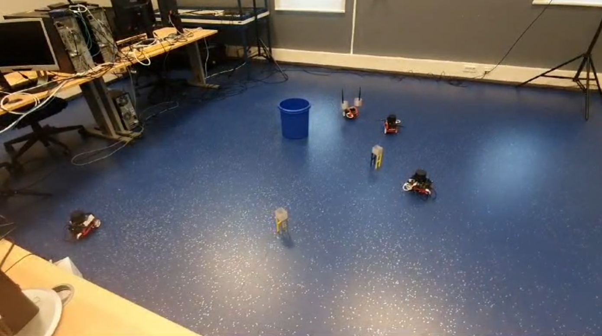

# Robot Swarm Perception and Control Project
<u>**Authors**</u>: Code developed in equal contribution by Alexandru Dimofte and Jakub Lucki

This readme contains a high-level overview of the project. For more detailed information, see one of the reports in the `reports` folder. Each report was created and submitted independently by Alexandru Dimofte and, respectively, by Jakub Lucki, with minor collaborations on the figures.

<u>**Aim of the project**</u>: final project created as part of the course Robotics Practical II at the University of Groningen, taught by Professor Raffaella Carloni. 

<u>**Note on open sourcing this project**</u>: As per our knowledge, the RPII course has changed drastically since the year we took it, hence we feel comfortable open sourcing our project. Please contact us otherwise.

<u>**Note to Students**</u>: Although we open source this project, we encourage students taking a similar course to write their own solutions. We promise you it is very rewarding :) 

## Overview

The project provides an implementation of the perception and control modules for a swarm of three (wheeled) robots.

**Abilities**: 
- Robots asynchronous group in a triangular swarm formation given the locations of all other robots, communicated by the Odometry system 
- Each individual robot can detect obstacles and break away from the formation in order to avoid them. Once the obstacle is passed, the robot rejoins the formation. The strictness of the swarm formation can be changed.
-  All robots are able to individually detect a pair of "legs" and follow it. The detection is done via a trained SVM model. This works for both human legs, or a "legs" robot (see **Robots** section below).
-  In another setting where legs are not present, the experimenter can also take control of one of the robots. All other robots will try to maintain the formation, thus following the teleoperated robot.

## Environments
There are two types of environments: real and simulation. Development of the code was done primarily in the simulated environments, with minor tweaks for the real environment.

In both cases, the environments can contain obstacles and other robots.

All simulated environments can be found in `stage_simulation/world`.

**Real environments examples:**

**Simulated environments example** 
(Blue dot = Robot; Green connected dots = legs)

## Robots
Each robot contains:
-  A LiDAR sensor mounted on top, used to find obstacles and "legs"
-  Several reflective surfaces used by an OptiTrack motion capture system to determine the position of the robot in the real environment.
-  Two Actuated Wheels used for locomotion in 2 degrees of freedom. 

One exception to this is the "legs" robot, which only contains the two actuated wheels, and two antennas with cillinders attached as shown in the picture below.

For each robot used, a ROS2 node must be launched with an identifying string. We use "robot_1","robot_2", and "robot_3" and the agent robots; "robot_4" is used as the teleoperated legs robot.

## Keyboard Teleop
The `keyboard_teleop` folder contains code used to control robots using the keyboard or a gaming joystick. `keyboard_teleop/src/keyboard_teleop.cpp` can be used to send commands to a given target robot (this is usually the "legs" robot, but it can also be another "leader" robot).

## Finding "legs"
We followed the methodology introduced in [3].

The LiDAR hitpoints are clustered based on their respective L2 distance to each-other into separate arrays, each array defining an object. For each object, a set of features is extracted, namely: Girth, Depth and Width (see one of the reports, section II for details).

Supervised data was collected by running the robots in two settings:
1. Robot and legs, no obstacles
2. Robot and environment, no legs

Thus, a supervised dataset was compiled, consisting of X: (girth, depth, width) and y: bool signifying whether the object is a leg or not.

An SVM was then trained on this dataset and saved in `nullspace_control/model/model.svm`

## Null-space-based control and Swarm Formation
Null-space-based control is a robot control methodology introduced in [1] which can incorporate multiple tasks by combining two approaches known as competitive and cooperative behaviour coordination. It is implemented in `nullspace_control/scripts/nullspace_control.py`.

In our case, we combine three tasks and rank them according to their importance: **Obstacle Avoidance**, **Follow-me** and **Formation Control**.

- **Obstacle Avoidance**:
Defined to keep each robot at a distance of at least 0.4 meters from any obstacle. This is ranked as the highest priority tasks, in order to preserve the integrity of the robot.

- **Follow-Me**:
Once a pair of legs are found, this task maintains the robot closest to the legs at a distance of 0.5 +/- 0.1 meters. This robot is also refered to as the "leader" robot in our report. This is ranked as the second priority task.

- **Formation Control**:
This task was introduced into the null-space-based control framework by [2]. It maintains N (N=3 in our project) robots in a predefined formation based around a given centroid. For N=3, the formation becomes a triangle. This is ranked as the lowest priority task, since we want the robots to be able to break formtion easily when needed. 

## Running

Launch the following ROS2 nodes:
- One node for each agent robot;
- One node for the teleoperated robot (as well as the keyboard telop script);
- A node for your odometry system
- A node for the environment (simulated or real)

Once these nodes are launched, run `nullspace_control/scripts/agent.py` and enjoy.
 
**Tools Used**: Python, C++, OpenCV, ROS2, PyTorch, sklearn, LIDAR

## References

  - **[1]** Antonelli, G., Arrichiello, F., & Chiaverini, S. (2010). Flocking for multi-robot systems via the null-space-based behavioral control. Swarm Intelligence, 4, 37-56.
  - **[2]** Antonelli, G., Arrichiello, F., & Chiaverini, S. (2009). Experiments of formation control with multirobot systems using the null-space-based behavioral control. IEEE Transactions on Control Systems Technology, 17(5), 1173-1182.
  -  **[3]** Chung, W., Kim, H., Yoo, Y., Moon, C. B., & Park, J. (2011). The detection and following of human legs through inductive approaches for a mobile robot with a single laser range finder. IEEE transactions on industrial electronics, 59(8), 3156-3166.

